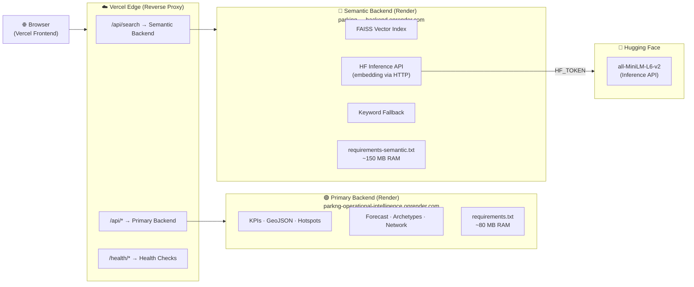
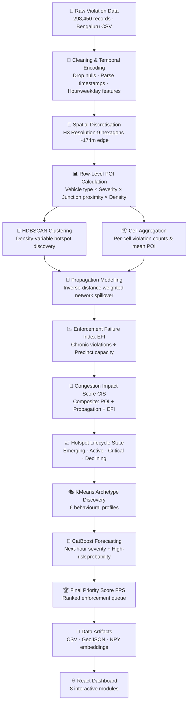
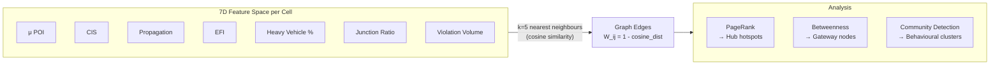
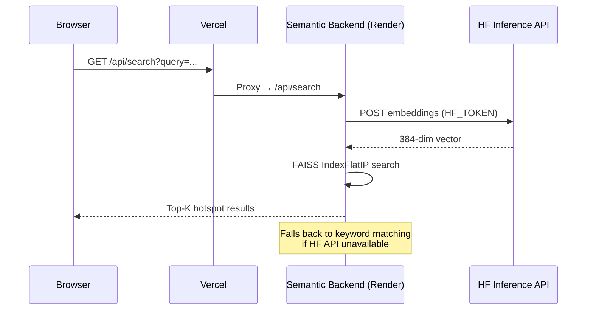

# 🚦 Parking Operational Intelligence Platform (POIP)

<div align="center">

[](https://parking-operational-intelligence.vercel.app/)
[](https://parking-operational-intelligence.onrender.com/health)
[](https://parking-operational-intelligence-backend.onrender.com/health)
[](https://react.dev/)
[](https://fastapi.tiangolo.com/)

**[🌐 Open Live Dashboard →](https://parking-operational-intelligence.vercel.app/)**

</div>

---

POIP transforms **298,450 raw parking violation logs** from Bengaluru into a real-time operational intelligence platform for traffic enforcement. It computes multi-dimensional congestion indices, predicts future hotspot severities, discovers spatial-behavioural archetypes, and generates a ranked daily enforcement queue — all served via a split-microservice architecture optimised for free-tier cloud hosting.

---

## ⚡ Dual-Backend Microservice Architecture

To prevent RAM out-of-memory (OOM) crashes on free-tier hosting (512 MB limit), POIP splits its backend into two independent Render services, unified behind a single Vercel frontend acting as a reverse proxy.



| Component | URL | Requirements | RAM |
|-----------|-----|-------------|-----|
| 🌐 Frontend | [vercel.app](https://parking-operational-intelligence.vercel.app/) | Vite + React + TS | Serverless |
| 🟢 Primary API | [onrender.com](https://parking-operational-intelligence.onrender.com) | `requirements.txt` | ~80 MB |
| 🔵 Semantic API | [onrender.com](https://parking-operational-intelligence-backend.onrender.com) | `requirements-semantic.txt` | ~150 MB |

### Why Two Backends?

`sentence-transformers` alone requires ~1.5 GB RAM. Render's free tier gives 512 MB. The solution: offload embedding extraction to the **Hugging Face Inference API** via a lightweight HTTP call (using `HF_TOKEN`), then search against a locally stored FAISS index. This keeps the semantic backend under 150 MB with full vector search capability.

---

## 🏗️ Analytics Pipeline



### Pipeline Stages

| # | Stage | Output |
|---|-------|--------|
| 1 | **Spatial Discretisation** | H3 cell IDs for every violation |
| 2 | **Parking Obstruction Index (POI)** | Per-row severity score (vehicle × zone × junction × density) |
| 3 | **HDBSCAN Clustering** | Organic hotspot boundaries without admin bias |
| 4 | **Propagation Modelling** | Neighbour congestion spillover via IDW |
| 5 | **Enforcement Failure Index (EFI)** | Chronic-vs-capacity ratio per precinct |
| 6 | **Congestion Impact Score (CIS)** | Unified 0–100 operational severity band |
| 7 | **Lifecycle States** | Emerging → Active → Critical → Declining |
| 8 | **Behavioural Archetypes (KMeans)** | 6 profiles: Junction Choke, Night Spillover, Freight, Commercial, Weekend Event, Mixed Risk |
| 9 | **CatBoost Forecasting** | Next-hour POI regressor + binary high-risk classifier |
| 10 | **Priority Engine (FPS)** | Final ranked daily enforcement queue |

---

## 🕸️ Network Intelligence (Pseudo-GNN)

The hotspot graph models the city as a **similarity-weighted undirected network** of the top 300 spatial cells.



Targeting **PageRank hubs** yields cascading compliance benefits — enforcing one hub propagates compliance to its entire behavioural neighbourhood.

---

## 🖥️ Dashboard Modules

| Module | Path | Data Source | Description |
|--------|------|-------------|-------------|
| Executive Command Center | `/` | `/api/kpis` | KPI cards, priority queue, hourly trend charts |
| **Semantic AI Search** | `/search` | `/api/search` (Semantic Backend) | Natural-language FAISS + HF API vector search |
| GIS Operations Map | `/map` | `/api/geojson` | Leaflet map: Priority · CIS · Archetype · Forecast layers |
| Hotspot Explorer | `/explorer` | `/api/hotspots` | Filterable, sortable hotspot data table |
| Forecast Center | `/forecast` | `/api/forecast` | CatBoost predictions vs. actuals |
| Archetype Intelligence | `/archetypes` | `/api/archetypes` | KMeans profiles with radar charts |
| Network Intelligence | `/network` | `/api/network` | Force-directed graph, PageRank centrality |
| Dynamic Policy Engine | `/policy` | `/api/hotspots` | Live CIS-driven zone governance simulator |

---

## 📂 Directory Structure

```
Parking_Operational_Intelligence/
├── backend/
│   ├── api/
│   │   ├── __init__.py
│   │   └── endpoints.py              # REST endpoints: /kpis /hotspots /geojson /forecast /archetypes /network /search
│   ├── services/
│   │   ├── __init__.py
│   │   └── data_service.py           # Data loading, FAISS index, HF API embedding, keyword fallback
│   ├── Artifacts/                    # Precomputed exports (CSV, GeoJSON, NPY embeddings)
│   ├── main.py                       # FastAPI app with CORS, startup loader, /health endpoint
│   ├── requirements.txt              # Primary backend — ultra-lightweight (~80 MB)
│   ├── requirements-semantic.txt     # Semantic backend — faiss-cpu + requests only (~150 MB)
│   ├── .env.example                  # Template: HF_TOKEN=your_token_here
│   └── .env                          # (gitignored) actual secrets
│
├── frontend/
│   ├── public/
│   ├── src/
│   │   ├── components/
│   │   │   └── ClusteredLayer.tsx    # Leaflet clustered GeoJSON layer component
│   │   ├── pages/
│   │   │   ├── ExecutiveCommandCenter.tsx
│   │   │   ├── SemanticSearch.tsx    # → routes to /api/search (Semantic Backend via Vercel)
│   │   │   ├── GISOperationsMap.tsx
│   │   │   ├── HotspotExplorer.tsx
│   │   │   ├── ForecastCenter.tsx
│   │   │   ├── ArchetypeIntelligence.tsx
│   │   │   ├── NetworkIntelligence.tsx
│   │   │   └── DynamicPolicyEngine.tsx  # Slider-driven live zone governance
│   │   ├── App.tsx                   # React Router setup
│   │   ├── Layout.tsx                # Sidebar navigation
│   │   └── index.css
│   ├── vercel.json                   # Reverse proxy routing rules
│   ├── vite.config.ts
│   └── package.json
│
├── Notebook/
│   └── flipkart-gridlock-r2-theme-1-solution.ipynb   # Full analytics & ML training notebook
│
├── Report/
│   └── Parking_Operational_Intelligence_Report.pdf   # Technical report
│
└── README.md
```

---

## 🚀 Getting Started (Local)

### Backend
```bash
cd backend
pip install -r requirements.txt        # or requirements-semantic.txt for search
cp .env.example .env                   # add your HF_TOKEN
uvicorn main:app --reload
# API available at http://127.0.0.1:8000
```

### Frontend
```bash
cd frontend
npm install
npm run dev
# App available at http://localhost:5173
```

---

## 🌐 Deployment (Dual-Backend on Render + Vercel)

### Step 1: Primary Backend → Render

1. New **Web Service** → connect this repo
2. Settings:
   - **Root Directory**: `backend`
   - **Build Command**: `pip install -r requirements.txt`
   - **Start Command**: `uvicorn main:app --host 0.0.0.0 --port $PORT`
3. Note the deployed URL (e.g. `https://parking-operational-intelligence.onrender.com`)

### Step 2: Semantic Backend → Render *(lean by design, free-tier safe)*

> No `sentence-transformers` loaded locally. Embeddings are fetched from the Hugging Face Inference API via a single HTTP call, then matched against the local FAISS index. RAM stays under 150 MB.

1. New **Web Service** → same repo
2. Settings:
   - **Root Directory**: `backend`
   - **Build Command**: `pip install -r requirements-semantic.txt`
   - **Start Command**: `uvicorn main:app --host 0.0.0.0 --port $PORT`
   - **Instance Type**: Free (512 MB is sufficient)
3. **Environment Variables** in Render dashboard:

   | Key | Value |
   |-----|-------|
   | `HF_TOKEN` | Get free at [huggingface.co/settings/tokens](https://huggingface.co/settings/tokens) |

4. Note the deployed URL (e.g. `https://parking-operational-intelligence-backend.onrender.com`)

### Step 3: Frontend → Vercel

1. Import repo → **Framework**: Vite, **Root Directory**: `frontend`
2. Vercel automatically reads `frontend/vercel.json` which routes:
   - `/api/search` → Semantic Backend
   - `/api/*` → Primary Backend
   - `/health/primary` and `/health/semantic` → respective health endpoints
3. No frontend environment variables needed — all routing is server-side via `vercel.json`

```json
{
  "rewrites": [
    { "source": "/api/search",    "destination": "https://<semantic>.onrender.com/api/search" },
    { "source": "/api/:path*",    "destination": "https://<primary>.onrender.com/api/:path*" },
    { "source": "/(.*)",          "destination": "/index.html" }
  ]
}
```

---

## 🤖 Semantic Search — How It Works



---

## 📊 Key Metrics

| Metric | Value |
|--------|-------|
| Raw violation records | 298,450 |
| H3 spatial cells | ~7,800 |
| Hotspot clusters (HDBSCAN) | ~420 |
| Archetype profiles (KMeans) | 6 |
| Graph nodes (Network Intelligence) | 300 (top by PageRank) |
| Forecast model | CatBoost (regressor + classifier) |
| Semantic index dimensions | 384 (all-MiniLM-L6-v2) |
